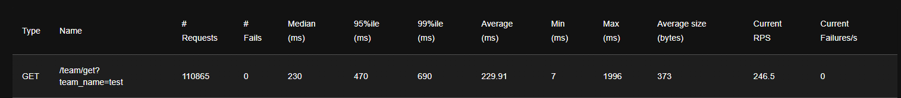

### Развёртывание
1. Добавить `.env` файл (`.env.example` прилагается)
2. Поднять проект в контейнере с помощью `docker-compose up`

# Дополнительные задания
1. Эндпоинт статистики - `http://localhost:8080/stats/get/`. Параметры - `user_id: str`
2. Массовая деактивация пользователей - `http://localhost:8080/users/deactivate`. Параметры - `user_ids: list[str]`
3. Нагрузочный тест - `uv run locust -f locustfile.py --host=http://127.0.0.1:8080`
